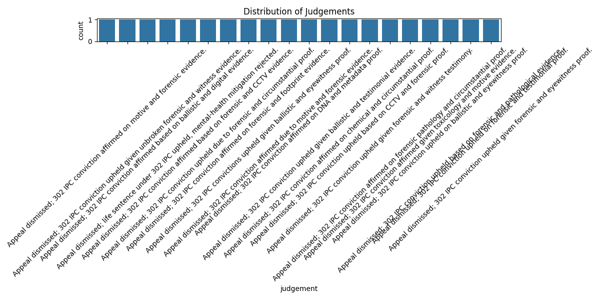
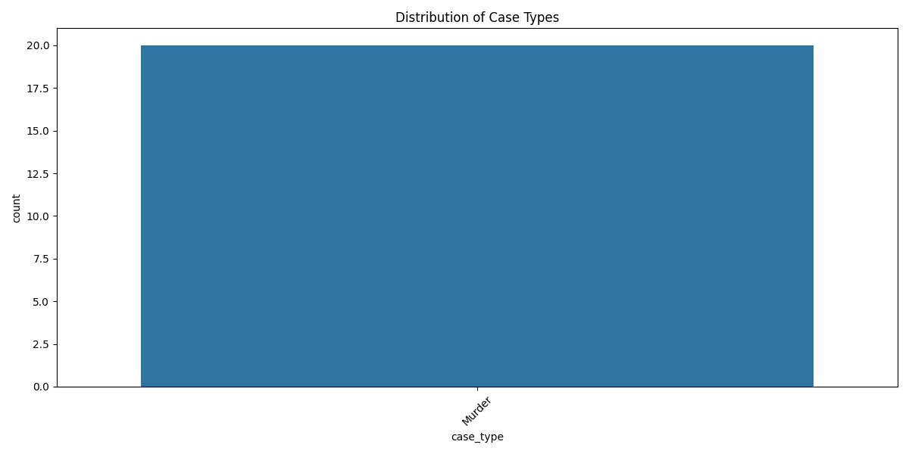

# 🏛️ AI Court

AI-powered Indian legal case classifier and precedent search (production-ready, memory-efficient)

[](https://www.python.org/downloads/)
[](#current-model)
[](#current-model)
[](#deploy-on-render-free-tier)

This project provides a Flask API that predicts court case outcomes and optionally retrieves similar precedents. It ships a small, fast scikit‑learn model (TF‑IDF + boosted random forest) suitable for 512MB deployments (e.g., Render free tier). Optional features include lexical/semantic search, drift monitoring, and a shadow transformer "multi‑axis" model.

## ✨ Key Features

- **🎯 Confidence-Based Predictions**: Returns confidence scores with automatic abstention for uncertain cases
- **🔍 Explainable AI**: Returns key factors (TF-IDF features) that influenced each prediction
- **📚 RAG-Style Search**: Retrieval-augmented responses using case precedent database
- **🔄 Active Learning**: Auto-queues low-confidence predictions for human review
- **💰 Zero API Cost**: Local extractive summarization (no HuggingFace API required)
- **📊 Class Imbalance Handling**: Optional SMOTE oversampling for minority classes
- **🏃 Memory Optimized**: Runs on Render free tier (512MB RAM)

---

## 📈 Current Model

Source: `models/metrics.json` and `models/metadata.json`

- Training rows: 10,838
- Classes (3): Acquittal/Conviction Overturned; Relief Denied/Dismissed; Relief Granted/Convicted
- Test accuracy: 0.9179
- Test macro‑F1: 0.8270
- Per‑class F1:
  - Acquittal/Conviction Overturned: 0.636
  - Relief Denied/Dismissed: 0.883
  - Relief Granted/Convicted: 0.962
- Class distribution:
  - Relief Granted/Convicted: 7,663
  - Relief Denied/Dismissed: 1,901
  - Acquittal/Conviction Overturned: 1,274

Artifacts:
- Model: `models/legal_case_classifier.pkl`
- Metrics: `models/metrics.json`
- Metadata: `models/metadata.json`

See also:
- Dataset sheet: [docs/DATA_SHEET.md](docs/DATA_SHEET.md)
- Model card: [docs/MODEL_CARD.md](docs/MODEL_CARD.md)
- Ontology notes: [docs/ONTOLOGY.md](docs/ONTOLOGY.md)
- Distributions:  · 

---
## 🚀 Quick Start

### 1) Setup Environment (Windows PowerShell)

```powershell
# Create virtual environment
python -m venv .venv

# Activate (Windows PowerShell)
.\.venv\Scripts\Activate.ps1

# Install dependencies (or use the VS Code task "Install Python deps")
pip install -r requirements.txt
```

### 2) Environment Variables

Copy `.env.example` to `.env`:
```bash
# Core paths
MODEL_PATH=models/legal_case_classifier.pkl
SEARCH_INDEX_PATH=models/search_index.pkl

# Memory optimization (for Render free tier 512MB)
LOW_MEMORY=1
DISABLE_SEARCH_INDEX=0
DISABLE_SEMANTIC_INDEX=1
GUNICORN_WORKERS=1
GUNICORN_THREADS=2

# Confidence & Explainability
CONFIDENCE_THRESHOLD=0.5          # Flag predictions below this
AUTO_QUEUE_LOW_CONFIDENCE=1       # Auto-add to review queue
EXPLAIN_TOP_K=5                   # Key factors in response

# Summarization (zero API cost)
USE_LOCAL_SUMMARY=1               # Use local extractive (no HF API)

# Optional
API_KEY=
SENTRY_DSN=
APP_VERSION=0.1.0
GIT_COMMIT=
```

### 3) Run the API

```powershell
# Start API server (dev)
python run_server.py

# Or use the VS Code task: "Run API (dev)"
```

---

## 📚 Data Collection (Kanoon)

Two entry points are available for harvesting queries into CSVs under `data/raw` and enriched data under `data/raw_enriched`.

Basic harvest (defaults):

```powershell
python scripts/kanoon_harvest.py
```

Custom harvest (Windows PowerShell env variables):

```powershell
$env:KANOON_PAGES='3'; $env:KANOON_QUERIES_FILE='data/queries.csv'; python scripts/kanoon_harvest.py
```

Build a lexical search index from processed CSVs:

```powershell
python scripts/build_search_index.py
```

Logs are written to `logs/legal_scraper.log` and `logs/enrich_hf.log`.

---

## 🤖 Model & Training

We default to a classical pipeline: TF‑IDF text features + boosted random forest. The artifact is serialized via `dill`.

Train/evaluate locally:

```powershell
python scripts/train_model.py
# or the full pipeline
python scripts/train_full_pipeline.py
```

Artifacts will be saved under `models/` (including `metrics.json`, `metadata.json`, and `history.log`).

---

---

## 🌐 API Server (Flask)

### Deploy on Render (Free tier, 512MB)

Set these environment variables in your Render service to keep memory within 512MB:

```
LOW_MEMORY=1
DISABLE_SEARCH_INDEX=1
DISABLE_SEMANTIC_INDEX=1
GUNICORN_WORKERS=1
GUNICORN_THREADS=1
```

Notes:
- With LOW_MEMORY enabled, only the classifier model is loaded; `/api/search` returns 503 unless you ship `models/search_index.pkl` and set `DISABLE_SEARCH_INDEX=0`.
- Disable semantic index for free tier; enable only if you ship `models/semantic_index.pkl`.
- Gunicorn preloading is disabled and concurrency is minimal to avoid memory duplication.
- `.dockerignore` trims heavy folders to keep the image small.

### Start Server

```powershell
# Development server (Flask)
python run_server.py
# http://127.0.0.1:5002

# Production server (Gunicorn)
gunicorn -c gunicorn.conf.py src.ai_court.api.server:app
```

### API Endpoints

| Endpoint | Method | Description |
|----------|--------|-------------|
| `/api/health` | GET | Health check |
| `/api/questions` | GET | Get questionnaire |
| `/api/questions/<case_type>` | GET | Questions for specific case type |
| `/api/analyze` | POST | Predict case outcome (uses summary + answers) |
| `/api/search` | POST | Lexical/semantic search for similar cases |
| `/api/analyze_and_search` | POST | Combined prediction + search |
| `/version` | GET | API version & model metadata |
| `/metrics` | GET | Prometheus metrics |
| `/api/drift/baseline` | GET | Baseline class distribution |
| `/api/drift/compare` | POST | Compare class distribution (drift detection) |
| `/api/drift/history` | GET | Recent drift history events |
| `/api/questions` | GET | Questionnaire structure |
| `/api/questions/<case_type>` | GET | Case-type specific follow-ups |
| `/api/ontology` | GET | Ontology tree (if available) |
| `/api/metrics/hierarchical` | GET | Ontology-aggregated class metrics |
| `/api/active_learning/queue` | GET/POST | Minimal in-memory AL queue |
| `/api/rag/query` | POST | RAG stub: retrieve docs only |

### Example: Analyze

```python
import requests

payload = {
  "case_type": "Criminal",
  "summary": "Accused seeks bail; key witness hostile; co-accused granted bail; no prior record",
  "witness_hostile": "Yes",
  "contradictions": "Yes",
  "fir_delay": "1-3 days"
}

r = requests.post("http://127.0.0.1:5002/api/analyze", json=payload)
print(r.status_code, r.json())

### Example: Search (if enabled)

r = requests.post("http://127.0.0.1:5002/api/search", json={"query": "contract dispute injunction", "k": 5})
print(r.status_code, r.json())
```

---

## 📖 Documentation

- Model card: [docs/MODEL_CARD.md](docs/MODEL_CARD.md)
- Data sheet: [docs/DATA_SHEET.md](docs/DATA_SHEET.md)
- Ontology: [docs/ONTOLOGY.md](docs/ONTOLOGY.md)

### Quick Commands

```powershell
# Status & Monitoring
python quick_status.py              # Quick stats
python metrics_dashboard.py         # Full dashboard

# Data Collection
python scripts/continuous_collector.py  # Start collector
python scripts/kanoon_harvest.py        # Legacy harvester

# Training
python scripts/pipeline/batch_trainer.py --batch_size 1000 --force
python scripts/train_model.py           # Legacy trainer

# API
python run_server.py                               # Dev server
gunicorn -c gunicorn.conf.py src.ai_court.api.server:app  # Production

# Testing
python -m pytest -q                 # Run tests
python scripts/smoke_client.py      # API smoke test

# Database
sqlite3 data/legal_cases_10M.db "SELECT COUNT(*) FROM cases"
python scripts/build_search_index.py  # Build search index
```

---

## 🐳 Docker Deployment

### Docker Compose (Recommended)

```powershell
docker compose up --build
```

### Manual Docker

```powershell
# Build image
docker build -t ai-court .

# Run container
docker run --rm -p 8000:8000 -e MODEL_PATH=/app/models/legal_case_classifier.pkl ai-court
```

---

## 🧪 Testing

```powershell
# Run all tests
python -m pytest -q

# Run specific test
python -m pytest tests/test_api_basic.py -v

# Test with coverage
python -m pytest --cov=src --cov-report=html

# Smoke test API
python scripts/smoke_client.py
```

### Available Tests
- `test_api_basic.py` - Basic API functionality
- `test_drift_history.py` - Drift detection
- `test_model_metrics_endpoint.py` - Model metrics endpoint
- `test_regression_macro_f1.py` - F1 score regression
- `test_regression_relative.py` - Relative performance regression
- `test_version_and_metrics.py` - Version & metrics endpoints

---

## 📊 Monitoring & Metrics

- Prometheus metrics at `/metrics`
- Version and model info at `/version`
- Drift monitoring:
  - Baseline: `/api/drift/baseline`
  - Compare (POST counts): `/api/drift/compare`
  - History: `/api/drift/history`

Drift comparisons are appended to `logs/drift_history.log`.

---

## 🔐 Security & Limits

- Optional API key: set `API_KEY` and send header `X-API-Key: <value>`
- Rate limiting: 60/min default (memory). For multi‑instance, set `RATE_LIMIT_STORAGE_URI` to Redis, e.g. `redis://host:6379`.
- Optional error tracing: set `SENTRY_DSN` (plus `SENTRY_TRACES_SAMPLE_RATE`, `SENTRY_PROFILES_SAMPLE_RATE`).

---


---

## ✅ Quick Checklist

- [ ] Python 3.12+ and dependencies installed
- [ ] Model file at `models/legal_case_classifier.pkl`
- [ ] Optional: `models/search_index.pkl` if enabling `/api/search`
- [ ] Environment tuned for target (Render free tier: LOW_MEMORY=1, DISABLE_* indices)
- [ ] Start with `python run_server.py` (dev) or Gunicorn (prod)

---

## 🧩 Extras

- Shadow “multi‑axis” inference: set `ENABLE_MULTI_AXIS_SHADOW=1` (requires promoted checkpoint under `models/multi_axis/`)
- Active learning queue: `/api/active_learning/queue`
- RAG stub: `/api/rag/query` (retrieves top docs if a lexical index exists)

## Model governance & run history

- Each training run is saved under `models/runs/<timestamp>_<shortuuid>/` with:
  - `legal_case_classifier.pkl`, `metrics.json`, `confusion_matrix.json`, `metadata.json`
- Latest run artifacts are copied to `models/` for API use.
- Lineage: `metadata.json` includes `run_id` and `previous_run`.
- History: `models/history.log` (JSON Lines) appends each run’s metadata.
- Regression guard: test suite checks for excessive accuracy drop between runs.
- Drift: `/api/drift/baseline` returns baseline class distribution and duplicate ratio; `/api/drift/compare` computes divergence from posted prediction histogram.
  - Agreement monitoring: `/api/metrics/agreement` exposes live classical vs multi-axis agreement stats (updated as requests come in).
  - Embedding / retrieval index drift: `scripts/drift_monitor.py --current retrieval_index/segments --previous <prev_dir> [--current-label-dist metadata.json --previous-label-dist prev_metadata.json]` outputs centroid shift, cosine distance, and KL/JS label distribution drift.
  - Store output as `drift_last.json` to have it included in consolidated `governance_status.json`.
  - Each compare call is appended (best-effort) to `logs/drift_history.log` for audit.
  - `/api/drift/history?limit=50` returns recent drift events (tail).
  - `/api/metrics/model` exposes latest evaluation metrics & selected metadata.
- Retrieval evaluation: multi-axis training auto-computes retrieval recall@K if `data/queries.csv` and `retrieval_index/segments` exist (`RETRIEVAL_EVAL_*` env vars) and saves under `retrieval_eval` in `metrics_multi_axis.json`.
- Gating: `scripts/model_gate.py` applies absolute + relative thresholds (macro F1, conflict rate, retrieval recall) to decide promotion → writes `models/multi_axis/promoted.json`.
- Shadow / primary multi-axis inference:
  - `ENABLE_MULTI_AXIS_SHADOW=1` (default) runs multi-axis model in parallel; `/api/analyze` returns classical + axis predictions + `agreement_rate`.
  - `USE_MULTI_AXIS_PRIMARY=1` promotes multi-axis relief/substantive/procedural fallback chain as the primary `judgment` in API responses (original classical label still available under `judgment_classical`).
- Agreement tracking: rolling agreement statistics maintained in-process; discrepancies sampled (future export to governance snapshot).
  - Persisted every 10 comparisons to `agreement_stats.json` (picked up by `governance_status.json`).
  - Governance endpoints: `GET /api/governance/status` (latest consolidated file), `POST /api/governance/refresh` (force rebuild).
  - Continuous refresh helper: `python scripts/refresh_governance_status.py 300` (interval seconds) to auto-update `governance_status.json`.
- Data quality: duplicate ratio and class distribution surfaced in metadata and endpoints.

- `src/ai_court/api/server.py` — Flask API
- `src/ai_court/model/legal_case_classifier.py` — training pipeline (TF-IDF + AdaBoost(RandomForest))
- `src/ai_court/scraper/legacy_kanoon.py` — Kanoon scraping (legacy)
- `src/ai_court/scraper/kanoon.py` — scraper wrapper module
- `src/ai_court/data/ingestion.py` — scraper wrapper → `data/raw/`
- `src/ai_court/data/prepare_dataset.py` — schema coercion → `data/processed/all_cases.csv`
- `scripts/build_search_index.py` — build semantic TF-IDF index → `models/search_index.pkl`
- `models/` — saved model artifacts
- `logs/` — scraper/debug logs
- `scripts/` — utilities (train_model.py, smoke_client.py, cleanup_repo.py)
- `docs/MODEL_CARD.md` — model description, metrics, limitations
- `docs/DATA_SHEET.md` — dataset description and considerations

## Notes

- Environment variables for governance:
  - `ALLOWED_ACCURACY_DROP` (default 0.15): max allowed relative drop in test accuracy between runs.
  - `DRIFT_JSD_WARN` (default 0.10): Jensen–Shannon divergence threshold for drift warning.
  - `DRIFT_JSD_ALERT` (default 0.20): threshold for drift alert.
    - `ALLOWED_ACCURACY_DROP` also enforced by tests; adjust as data scales.
    - `ALLOWED_MACRO_F1_DROP` (default 0.20) relative macro-F1 regression guard.

  CI / Automation variables (in GitHub Actions secrets recommended):
  - `API_KEY` (if you want CI smoke calls against protected endpoints in future extensions)
  - `SENTRY_DSN` (optional) for observability.

- Additional governance + multi-axis vars:
  - `MIN_MACRO_F1`, `MAX_CONFLICT_RATE`, `MIN_RETRIEVAL_RECALL`
  - `MACRO_F1_DROP_TOL`, `CONFLICT_RATE_INCREASE_TOL`, `RETRIEVAL_RECALL_DROP_TOL`
  - `RETRIEVAL_EVAL_QUERIES`, `RETRIEVAL_EVAL_K`, `RETRIEVAL_EVAL_MODEL`, `RETRIEVAL_EVAL_INDEX`
  - `ENABLE_MULTI_AXIS_SHADOW` (default 1), `USE_MULTI_AXIS_PRIMARY` (default 0), `MULTI_AXIS_INFER_MAX_LEN`
  - `SEM_RETRIEVAL_TOP_K`, `RETRIEVAL_TOP_K` (lexical/semantic context augmentation during training)

- Do not commit secrets. Use `.env` and environment variables.
- With tiny classes, stratified splitting is disabled to avoid errors.
- Add more judgments to improve accuracy; keep the schema.

## Production quickstart

- To check model drift:
  - `GET /api/drift/baseline` for reference distribution.
  - `POST /api/drift/compare` with `{ "counts": {"ClassA": 10, "ClassB": 5, ...} }` to compare live predictions.

1) Harvest data (optional at first):
  - Use default queries: `python scripts/kanoon_harvest.py`
  - Or provide your own: create `data/queries.csv` (see `data/queries.example.csv`), then
    - PowerShell:
     - `$env:KANOON_PAGES="10"; $env:KANOON_QUERIES_FILE="data/queries.csv"; python scripts/kanoon_harvest.py`

2) Build dataset + Train model:
  - Full pipeline: `python scripts/train_full_pipeline.py`
  - Skip harvest (use existing CSVs): `python scripts/train_full_pipeline.py --skip-harvest`
  - Evaluate saved model: `python scripts/evaluate_saved_model.py`

3) Serve API (dev):
  - `python run_server.py`

4) Serve API (prod via Docker):
  - `docker build -t ai-court .`
  - `docker run -p 8000:8000 -v %cd%/models:/app/models ai-court`
  - Or: `docker compose up --build`

5) Health check:
  - `GET /api/health` → `{ "status": "ok" }` when the model is ready
## Semantic search

- Build the index from scraped CSVs or the processed dataset fallback:
  - `python scripts/build_search_index.py`
- Build a semantic (dense) embedding index (SentenceTransformers):
  - `python scripts/build_semantic_index.py --model all-MiniLM-L6-v2`
  - Server prefers semantic index first if `SEMANTIC_INDEX_PATH` (default `models/semantic_index.pkl`) exists; falls back to TF-IDF.
- Query the API:
  - `POST /api/search` with `{ "query": "appeal dismissed conviction upheld", "k": 5 }`
- Test locally without server:
  - `python scripts/search_smoke.py`

Notes:
- The API auto-loads the search index from `SEARCH_INDEX_PATH` when present.
 - The API auto-loads the semantic embedding index from `SEMANTIC_INDEX_PATH` if present (higher relevance for longer queries).
- The server emits structured JSON logs with request IDs and latencies. Provide `X-Request-ID` to trace requests end-to-end.
 - The index builder prefers `data/raw_enriched/` automatically when available, otherwise falls back to `data/raw/` or the processed dataset.
 - For production rate limiting, set `RATE_LIMIT_STORAGE_URI=redis://<host>:<port>`; otherwise an in-memory backend is used (not recommended for multi-instance).
 - Optional error tracking: set `SENTRY_DSN` along with `SENTRY_TRACES_SAMPLE_RATE` and `SENTRY_PROFILES_SAMPLE_RATE` for performance telemetry.


## Scaling data & quality

- Target dataset sizes:
  - MVP: 5k–10k labeled judgments (≥500 per class)
  - Strong: 20k–50k (≥1k per class)
  - Enterprise: 100k–200k+
- Reduce the `Other` class by expanding `normalize_outcome()` mappings and auditing labels.
- Prefer temporal splits; monitor per-class F1 and confusion matrix.
